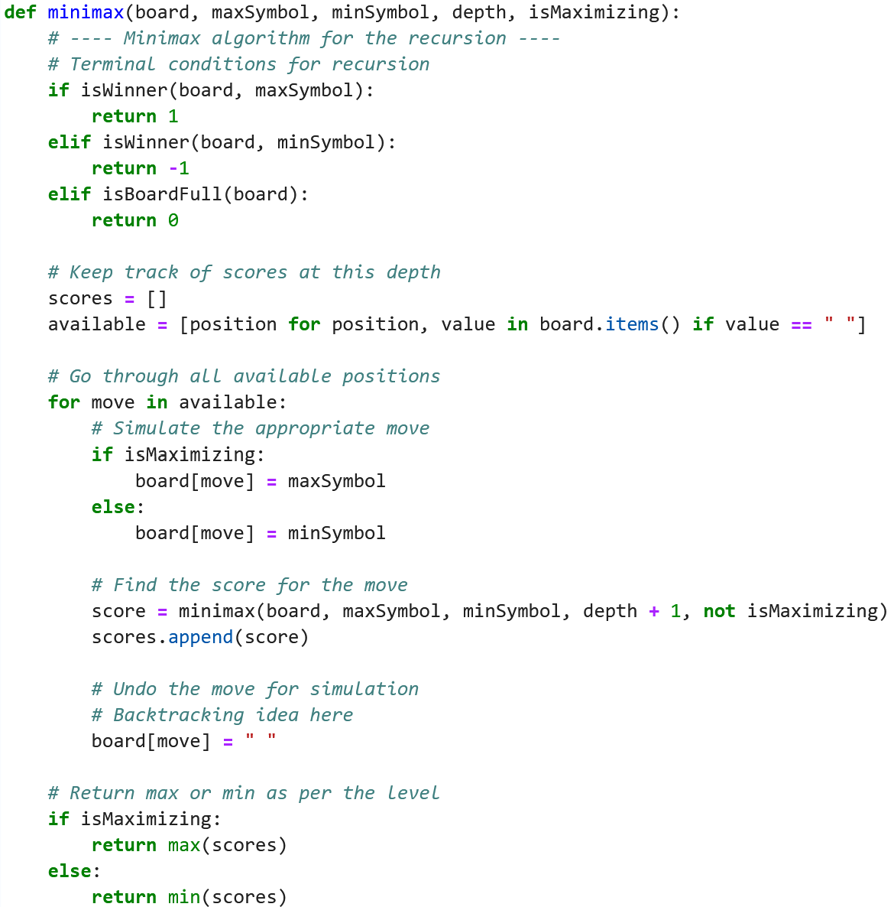

# Solving games using search algo

## Time limitation

Games are usually time limited such as chess. Each move has an average branching factor of 35 and it is not practical to perform a complete search.

## Uncertainty

Must account for hostile agents

- Assumption that opponent agent's goal is to diminish our utility
- we do not consider randomness and non-deterministic action for simplicity

## Information available

The amount of information that the agent has to make decisions. Having perfect information means the agent has complete information about opponent position and actions available.

## Overview of the type of games

|   | Deterministic | Chance |
| --- | --- | --- |
| Perfect information | Chess, Checker, Go | Monopoly |
| Imperfect information |   | Poker, Bridge, Scrabble |

## Search strategy

There must be a payoff function that can calculate utility so that agent can make the best decision. The payoff function tries to quantify the meaning of win/loss and always does it in the point of the view of the maximiser.  

### Minimax search

**Minimax search** technique is one of them. Assume that both agent and opponent will maximise self utility and minimise the other's utility. Note we are considering only zero-sum game here where victory of one results loss in the other.

3-step process

1. Generate entire board to terminal states
2. Calculate utility of each leaf and determine the utility of parent node till root node is reached
3. Best move is chosen (that is the highest utility)

&nbsp;

&nbsp;

#### Perfect decisions

For the perfect decisions to be made by the algo, at least 2 of these conditions must be fulfilled

1. No time limit, then complete tree can be generated
2. Max (agent) always maximises utility and Min (opponent) minimise utility

#### Imperfect decisions

When the costs of computing to terminal state is too high, it can be impractical to do so. There are also instances where there is a time limit and the algo has to use some estimation to determine utility.

1. Utility function replaced by evaluation function that estimates desirability
2. Partial tree search done instead
    - can be done with depth limit or having a cut-off test

## Evaluation functions

When the search tree is too big to create within the time given, we can use evaluation functions given by domain experts on expected utility for a given assignment. This allows limited generation of the search tree which would save a great amount of time.
